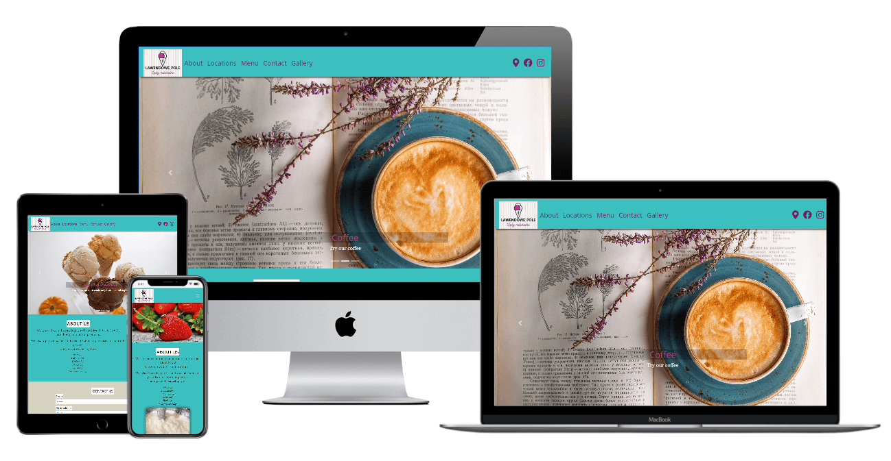

# 
# About this Website                                               
### "Lawendowe Pole"(en-"Lavender Field") is an existing small family run company producing the own recipe full natural ice-creams and deserts with the main Café and two small ice cream shops located outside Kraków in local tourist places.

:globe_with_meridians: [Live website](https://mateuszniechwiej.github.io/Ms-1-LP/)

### This website is built for Milestone Project 1("Code Institute") with HTML5, CSS3 and Bootstrap framework.The main goal is that users will find an easy navigated, intuitive and well visiual designed website with all information about products, locations and all other services provided by the company.

# Table of Contest
* [User Experience(UX)](#UX)
  * [User Stories](#User-Stories)
  * [Design](#Design)
    * [Colour Scheme](#Colour-Scheme)
    * [Typography](#Typography)
    * [Imagery](#Imagery)
    * [Wireframes](#Wireframes)
* [Features](#Features)
  * [Existing Features](#Project-Features)
  * [Future Features](#Future-Features)
* [Technologies Used](#Technologies-Used)
  * [Languages Used](#Languages-Used)
  * [Framework](#Framework)
  * [Programs and Libaries](#Programs-and-Libaries)
* [Testing](#Testing)
  * [Css/Html Validation](#CSS/HTML-Test)
  * [Colour Contrast](#Colour-Contrast)
* [Deployment](#Deployment)
* [Credits](#Credits)
  * [Code](#Code)
  * [Media](#Media)
    * [Images](#Images)
  
  

# UX    
:pushpin: 
  ## User Stories
  ### As a new user, I want to...

 * Easy and intuitive navigate through the website to find :
    * information out about the product and services the company offers.  
    * Locate the Cafe and the  remaining ice-cream shops.
    * Find out about the menu 
    * know what kind of facilities are available in each of the locations( like parking, seat in/out, is coffee/drinks available and other deserts, can I pay with card)
    * Find about opening times and form of contact.
    * Find any reviews about the place on social media.
    * Find photos or videos of the places and products.
  * I want to be abble to enjoy the design of the website and the content
  * I want to easy navigate on mobile phones and tablets and be abble to see all the content.
  ### As a returning customer, I want to ...
  * Find about any new products the company is offering
  * information about the times opening changes(if they occur)
  * to see new images or videos of the places and products.
  
:pushpin:
## Design
   ### Colour Scheme
   * Colours used in the project were picked with the main focus on 2 colours:
     * purple (which is the main colour for the brand) as "Lavender field"("Lawendowe Pole") is the name of the company and they use colours associated with their name.
     * turquoise as the company use this colour together with purple in the social media adverts and it looks well for companies associated with sweets, desserts and ice creams.
*  *Adobe Color* was used to create the colour palette
  :point_down:

   
  
## Typography
   :black_nib:
   * The primary font used in this project is **Open Sans** with *sans-serif* as a fallback font. This font is elegant and also modern. It offers an excellent reading experience.
   *  The secondary font used for this website is __Libre Baskerville__ with _sans-serif_ as a fallback font. It's a web font optimized for body text and often used with **Open Sans**.
### Imagery
#### As this website is for an ice cream company, images are a very important part of this project.
* There is a logo image(provided by the owner of the company) appearing on each of the HTML pages in the navbar and will be displayed through all the devices(mobile, tablet and desktop).
* On the homepage, there is an image carousel with 3 photos of the product with caption displayed on larger screens(images were resized and optimized) for better user experience and website performance.
* There is also a separate *__Gallery__* page with images of the products and pictures from the Café and company ice cream shops(resized into square images and optimized) 
### Wireframes
:point_right: [Wireframes for mobile,tablet and desktop](https://xd.adobe.com/view/90708c4b-fc61-4ca3-95a0-3f497bdf5165-c523/)

:point_right: [Wireframes - pdf](/assets/wireframes/wireframes.pdf)
#
# Features 
:pushpin:
## Project Features:
* Navbar with logo, icon linked to locations section, and "hamburger menu" on mobiles and tablets.
* links to Facebook, Instagram and TripAdvisor(prefered in the footer) and directionlocation icon in both navbar nad footer as this place is located in local tourist attraction approx. 30km from Kraków city.
* a page for filing in a "Form"  for customers to be able to contact the company. (booking, coments)
* a page with locations and small icons with descriptions on times and services of each place.With link directions
* a link to download and view menu in pdf opened in new tab.
* moving carousel photo gallery.
    
:pushpin: 
## Future Features:
* payment options for pre-ordered products for collections.
* polish language version  
#
# Technologies Used
:pushpin:
## Languages Used
  *  [HTML5](https://en.wikipedia.org/wiki/HTML5)
  *  [CSS3](https://en.wikipedia.org/wiki/CSS)
  
  :pushpin:
## Framework
  * [Bootstrap v.4.5.2](https://getbootstrap.com/) - used for layouts,styling and custom componets such as navigation bar or image carousel.
  
  :pushpin:
## Programs and Libaries 
  * [JPEG-OPTIMIZER](http://jpeg-optimizer.com/) - optimized the size of images used in this project
  * [tinypng](https://tinypng.com/) - optimized Mockup.png for README
  * [Concpets](https://concepts.app/en/) - to creat first handrawn wireframes
  * [Adobe Xd](https://www.adobe.com/ie/products/xd/wireframing-tool.html#:~:text=Adobe%20XD%20is%20a%20powerful,all%20in%20one%20design%20tool.) - for wireframing
  * [Adobe Colour](https://color.adobe.com/create/color-wheel) - for colour palette used in this project
  * [Adobe Photoshop Express](https://photoshop.adobe.com/?promoid=SYBNM1DC&mv=other) - To resize or crop  the images for carusel in landing page and     images in gallery.
  * [Google Fonts](https://fonts.google.com/)- to import 'Open Sans' and 'Libre Baskerville' fonts used through this project
  * [Font Awesome](https://fontawesome.com/) - for social media links on the website and svg used in wireframes
  * [Visiual Studio Code](https://code.visualstudio.com/) - used to write this README.md
  * [GitPod](https://www.gitpod.io/) - used for developing the website and commit the project to Github repository.
  * [Github](https://github.com/) - used to host the project and deploy live website through [Git Pages](https://pages.github.com/).
  * [Google Developer Tools](https://developers.google.com/web/tools/chrome-devtools) - used to debug and test the website , and to ensure colour contrast
    * [Lighthouse](https://developers.google.com/web/tools/lighthouse) - as a part of chrome dev tool was used to improve the quality of the web page.
  * [Favicon](https://favicon.io/) - to creat favicon for this Website
  * [material.io](material.io) - Facebook svg used in my wireframe comes from material.io
  * [zamar.com](https://www.zamzar.com/convert/mp4-to-webm/) - to convert mp4 to webm as fallback video file.
  * [techsini](https://techsini.com/) - To generate website Mockup for README file.
  

# Testing 
:pushpin:
## CSS/HTML Test
### CSS Validator - Pass

    

### HTML Validator - Test
1. [Home page](assets/validator/validator_home.pdf)- pdf
* 4 errors found and fixed:
1. __inline__ attribiute - removed form *video* element
2. __value__ on *select* element - removed from *select* element
3. __type__ attribiute - removed from *textarea* element
4. __bad value__ - fixed telephone number spacing on **_a_** element for **_href_** attribiute

* 1 warning for sections 

2. [Locations page](assets/validator/validator_locations.pdf)-pdf
* 1 error found and fixed:
  1. __br__ tag - removed from *table* 

3. [Gallery page](assets/validator/validator_gallery.pdf)
* no errors found

:pushpin:
## Colour Contrast 
  * By using [Google Developer Tools](https://developers.google.com/web/tools/chrome-devtools) colour contrast was tested:
    1. On homepage of this project right click on the pc mouse
    2. Press - "Inspect"
    3. Press - ctr+shift+c or "small box with an arrow" to inspect elements of the website.
    4. Hover over elements to see under Accessibilty->Contrast the result.
   
* All html pages were tested and contarst was correct.

in progress

# Deployment 

# Credits 
:pushpin:
## Code
* [Bootstrap library](https://getbootstrap.com/) - used to creat a responsive design, creat navbar, image carousel with captions and form.
* To learn and creat box-shadow efect for navbar and footer :
    * [CSS-Tricks](https://css-tricks.com/almanac/properties/b/box-shadow/)
    * [Stack-Overflow](https://stackoverflow.com/questions/17739108/why-doesnt-the-box-shadow-show-above-the-footer-div)
* Used box shadow for my video- Efect number 7 :
  * [CSS-Tricks](https://css-tricks.com/almanac/properties/b/box-shadow/)
*  To learn how to center horizontly and verticaly video :
   *  [Stack-Overflow](https://stackoverflow.com/questions/42388989/bootstrap-4-center-vertical-and-horizontal-alignment)

:pushpin:
## Media
### Images
* Business owner of "Lawendowe Pole"- Images and video(used as a gif)   
* [Unsplash](https://unsplash.com/) - images
* [Pixabay](https://pixabay.com/) - images and gif video
  

in progress....