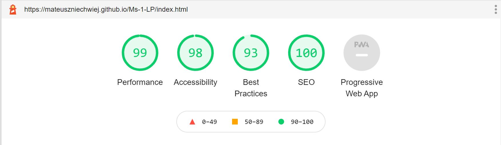
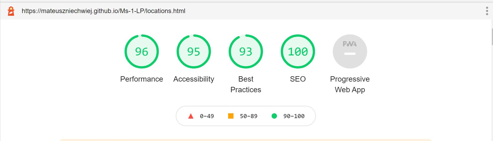
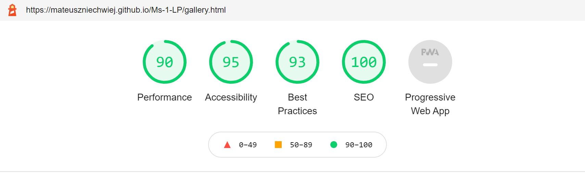

# 

# About this Website                                              

### "Lawendowe Pole"(en-"Lavender Field") is an existing small family run company producing the own recipe full natural ice cream and desserts with the main Café and two small ice cream shops located outside Kraków in local tourist places.

 

:globe_with_meridians: [Live website](https://mateuszniechwiej.github.io/Ms-1-LP/)

 

:page_facing_up: [GitHub repository](https://github.com/mateuszniechwiej/Ms-1-LP)

 

### This website is built for Milestone Project 1("Code Institute") with HTML5, CSS3 and Bootstrap framework. The main goal of this project is that users will find an easy navigated, intuitive and well visual-designed website with all information about products, locations and all other services provided by the company.

 

# Table of Contest

* [User Experience(UX)](#UX)

* [User Stories](#User-Stories)
* [Design](#Design)

  * [Colour Scheme](#Colour-Scheme)

  * [Typography](#Typography)

  * [Imagery](#Imagery)

  * [Wireframes](#Wireframes)

* [Features](#Features)

  * [Existing Features](#Existing-Features)

  * [Future Features](#Future-Features)

* [Technologies Used](#Technologies-Used)

  * [Languages Used](#Languages-Used)

  * [Framework](#Framework)

  * [Programmes and Libraries](#Programmes-and-Libraries)

* [Testing](#Testing)

  * [Css/Html Validation](#CSS-and-HTML-Test)

  * [Performance](#Performance)

  * [Colour Contrast](#Colour-Contrast)

* [Deployment](#Deployment)

* [Credits](#Credits)

  * [Code](#Code)

  * [Media](#Media)

  * [Images](#Images)

 

 

 

 

 

# UX   

:pushpin:
## User Stories

### As a new user, I want to. . .

 

#### Easy and intuitive navigation through the website to find

  * Information about the product and services the company offers. 
  * Locate the Cafe and the remaining ice-cream shops.
  * Menu
  * know what facilities are available in each location (like parking, seat in/out, is coffee/drinks available and other deserts, can I pay with card)
  * Find about opening times and form of contact.
  * Find any reviews about the place on social media.
  * Find photos or videos of the places and products.
  * I want to be able to enjoy the design of the website and the content
  * I want to easily navigate on mobile phones and tablets and be able to see all the content.

### As a returning customer, I want to :

* Find about any new products the company is offering

* Information about the times opening changes (if they occur)

* to see new images or videos of the places and products.

 

:pushpin:

## Design

### Colour Scheme

* Colours used in the project were picked with the focus on 2 colours:

* purple (which is the main colour for the brand) as "Lavender field"("Lawendowe Pole") is the name of the company and they use colours associated with their name.

* turquoise as the company use this colour together with purple in the social media adverts and it looks well for companies associated with sweets, desserts and ice creams.
* *Adobe Color* was used to create the colour palette

  :point_down:

 

   

 

## Typography

 :black_nib:

* The primary font used in this project is **Open Sans** with *sans-serif* as a fallback font. This font is elegant and modern. It offers an excellent reading experience.
* The secondary font used for this website is __Libre Baskerville__ with _sans-serif_ as a fallback font. It's a web font optimised for body text and used with **Open Sans** in modern web design.

## Imagery

### As this website is for an ice cream company, images are a crucial part of this project.

* There is a logo image (provided by the owner of the company) appearing on each HTML page in the navbar and will be displayed through all devices (mobile, tablet and desktop).

* In the homepage, there is an image carousel with 3 photos of the product with the caption displayed on larger screens (images resized and optimised) for better user experience and website performance.

* There is also a separate *__Gallery__* page with images of the products and pictures from the Café and company ice cream shops (resized into square images and optimised)

### Wireframes

:point_right: [Wireframes for mobile, tablet and desktop](https://xd.adobe.com/view/90708c4b-fc61-4ca3-95a0-3f497bdf5165-c523/)

 

:point_right: [Wireframes - pdf](/assets/wireframes/wireframes.pdf)

# Features

:pushpin:

## Existing Features:

 

:large_blue_circle: **Header** - with a navigation bar is located on the top of the pages (home, locations and galleries) to help the user easily navigate through the content with a box shadow effect for better visual experiences.

* Logo brand located on the left side of the navigation bar on all pages with a homepage link for locations and gallery pages.

* Navigation links are located:

  * For desktop - next to the logo with a hover effect changing colours from #73185b (main purple used in this project) to #d6d3c1 (shade of grey from colour palette used for this website) to let know the visitor knows that the link is clickable.

  * For mobile/tabet - a visitor will find a hamburger menu on the right side of navbar with navigation links collapse. Having the same hover effect.

* Locations and social media links visible only on the desktop on the right side of the navigation bar with a hover effect same as to be found for menu links. In the header we can find three icons:

    * location icon - by clicking on this icon user is brought to google maps in new tab were all 3 locations for the company (Café and the 2 remaining ice cream shops).

* Facebook and Instagram icons linked to existing company accounts

 

:large_blue_circle: **Image carousel** - with captions located under the navigation bar:

 

* Visitor will find there three images presenting company products and basic information moving to the next automatically to the next slide after 5 seconds.

 

* Carousel from bootstrap was used in this project to present the product for the visitor with professional images to attract new customers.

 

* Captions start to be visible from medium screens and on bigger smartphones in landscape view for a better visual experience. Colour used for the headings on each image is light purple (#bf3b9c) from the palette used across this project with rgba background for clear reading.

:large_blue_circle:
**Video as a gif** - muted and looping with an added shadow effect to attract customers and trigger the desire for this product.

:large_blue_circle:
**Contact Form** - section on the homepage for filing in a "Form"  for customers to be able to contact the company (booking, comments) with links to send mail and call the owners for more information.

:large_blue_circle:
**Footer** - with Facebook, Instagram and TripAdvisor links and copyright information.
* box shadow was added for visual experience.

:large_blue_circle:
**Locations page** - logo brand with active link to go back to homepage in the header and directions to all ice cream locations with facilities available on each one of them.
* an arrow to go back to the top of the page due to lenght to allow visitors to move easier through the website.

:large_blue_circle:
**Gallery page** - with 2 sections of product and places with an arrow on the bottom to allow visitors go back to the top of the page.
 

:pushpin:

## Future Features:

:white_circle: - payment options to pre-ordered products for collections.

:white_circle: - polish language version

:white_circle: - attach english menu.pdf to open in new tab

#

# Technologies Used

:pushpin:

## Languages Used

  *  [HTML5](https://en.wikipedia.org/wiki/HTML5)

  *  [CSS3](https://en.wikipedia.org/wiki/CSS)

 

  :pushpin:

## Framework

* [Bootstrap v.4.5.2](https://getbootstrap.com/) - used for layouts, styling and custom components such as navigation bar or image carousel.

 

  :pushpin:

## Programmes and Libraries

* [JPEG-OPTIMIZER](http://jpeg-optimizer.com/) - optimized the size of images used in this project

* [tinypng](https://tinypng.com/) - optimized Mockup.png for README

* [Concpets](https://concepts.app/en/) - to creat first handrawn wireframe
* [Adobe Xd](https://www.adobe.com/ie/products/xd/wireframing-tool.html#:~:text=Adobe%20XD%20is%20a%20powerful,all%20in%20one%20design%20tool.) - for wireframe

* [Adobe Colour](https://color.adobe.com/create/color-wheel) - for colour palette used in this project

* [Adobe Photoshop Express](https://photoshop.adobe.com/?promoid=SYBNM1DC&mv=other) - To resize or crop the images for carousel in landing page and images in the gallery.

* [Google Fonts](https://fonts.google.com/)- to import 'Open Sans' and 'Libre Baskerville' fonts used through this project

* [Font Awesome](https://fontawesome.com/) - for social media links on the website and SVG used in wireframe

* [Visual Studio Code](https://code.visualstudio.com/) - used to write this README.md
* [GitPod](https://www.gitpod.io/) - used for developing the website and commit the project to Github repository.

* [Github](https://github.com/) - used to host the project and deploy live website through [Git Pages](https://pages.github.com/).

* [Google Developer Tools](https://developers.google.com/web/tools/chrome-devtools) - used to debug and test the website, and to ensure colour contrast

* [Lighthouse](https://developers.google.com/web/tools/lighthouse) - as a part of the chrome dev tool was used to improve the quality of the web page.

* [Favicon](https://favicon.io/) - to create a favicon for this Website

* [material.io](material.io) - Facebook SVG used in my wireframe comes from material.io

* [zamar.com](https://www.zamzar.com/convert/mp4-to-webm/) - to convert mp4 to webm as fallback video file.

* [techsini](https://techsini.com/) - To generate website mock-up for README file.

# Testing

:pushpin:

## CSS and HTML Test

### CSS Validator - Pass

    <a href="http://jigsaw.w3.org/css-validator/check/referer">

        

    </a>

 

### HTML Validator - Test

1. [Home page](assets/validator/validator_home.pdf)- pdf

* 4 errors found and fixed

1. __inline__ attribute- removed form *video* element

2. __value__ on *select* element - removed from *select* element

3. __type__ attribute - removed from *textarea* element

4. __bad value__ - fixed telephone number spacing on **_a_** element for **_href_** attribute

 

* 1 warning for sections

 

2. [Locations page](assets/validator/validator_locations.pdf)-pdf

* 1 error found and fixed

  1. __br__ tag - removed from *table*

 

3. [Gallery page](assets/validator/validator_gallery.pdf)-pdf

* no errors found

 

:pushpin:

## Performance

### To improve and check performance for this website I used [Lighthouse](https://developers.google.com/web/tools/lighthouse) , which is part of [Google Developer Tools](https://developers.google.com/web/tools/chrome-devtools)

* Home Page Test:

  

* Locations Page Test:

  

* Gallery Page  Test:

  

:pushpin:

## Colour Contrast

* By using [Google Developer Tools](https://developers.google.com/web/tools/chrome-devtools) colour contrast was tested:

1. On the homepage of this project right click on the pc mouse

2. Press - "Inspect"

3. Press - ctr+shift+c or "small box with an arrow" to inspect elements of the website.

4. Hover over elements to see under Accessibility->Contrast the result.

 

* All Html pages were tested and contrast was correct.

 

In progress

 

# Deployment

 

# Credits

:pushpin:

## Code

* [Bootstrap library](https://getbootstrap.com/) - used to create a responsive design, creat navbar, image carousel with captions and form.

* To learn and create the box-shadow effect for navbar and footer:

  * [CSS-Tricks](https://css-tricks.com/almanac/properties/b/box-shadow/)

  * [Stack-Overflow](https://stackoverflow.com/questions/17739108/why-doesnt-the-box-shadow-show-above-the-footer-div)

* Used box shadow for my video- Effect number 7:

  * [CSS-Tricks](https://css-tricks.com/almanac/properties/b/box-shadow/)
 
* To learn how to centre horizontally and vertically video
  * [Stack-Overflow](https://stackoverflow.com/questions/42388989/bootstrap-4-center-vertical-and-horizontal-alignment)

 

:pushpin:

## Media

### Images

* Business owner of "Lawendowe Pole"- Images and video (used as a gif)  

* [Unsplash](https://unsplash.com/) - images

* [Pixabay](https://pixabay.com/) - images and gif video

 

 

In progress. . .