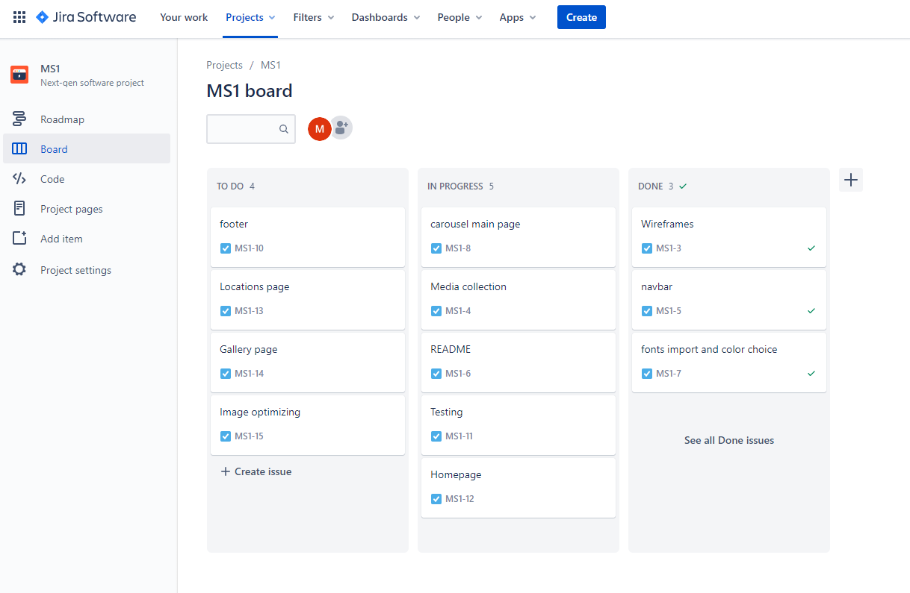

# 

# About this Website                                              

### "Lawendowe Pole"(en-"Lavender Field") is an existing small family run company producing the own recipe full natural ice cream and desserts with the main Café and two small ice cream shops located outside Kraków in local tourist places.

:globe_with_meridians: [Live website](https://mateuszniechwiej.github.io/Ms-1-LP/)

:page_facing_up: [GitHub repository](https://github.com/mateuszniechwiej/Ms-1-LP)

### This website is built for Milestone Project 1("Code Institute") with HTML5, CSS3 and Bootstrap framework. The main goal of this project is that users will find an easy navigated, intuitive and well visual-designed website with all information about products, locations and all other services provided by the company.

# Table of Contest

* [User Experience(UX)](#UX)
  * [User Stories](#User-Stories)
  * [Project Workflow](#Project-Workflow)
  * [Design](#Design)
    * [Colour Scheme](#Colour-Scheme)
    * [Typography](#Typography)
    * [Imagery](#Imagery)
    * [Wireframes](#Wireframes)
* [Features](#Features)
  * [Existing Features](#Features)
  * [Future Features](#Future-Features)
* [Technologies Used](#Technologies-Used)
  * [Languages Used](#Languages-Used)
  * [Framework](#Framework)
  * [Programmes and Libraries](#Programmes-and-Libraries)
* [Testing](#Testing)
  * [Responsiveness and Browsers Testing](#Responsivnes-and-Browsers-Testing)
  * [Css/Html Validation](#CSS-and-HTML-Test)
  * [Performance](#Performance)
  * [Colour Contrast](#Colour-Contrast)
  * [Functionality](#Functionality)
  * [Testing Users Stories](#Testing-Users-Stories)

* [Deployment](#Deployment)
    * [Project Initiation](#Project-Initiation)
    * [GitHub Pages](#GitHub-Pages)
    * [Local Clone](#Local-Clone)
* [Credits](#Credits)
  * [Code](#Code)
  * [Media](#Media)
  * [Images](#Images)
  * [Acknowledgements](#Acknowledgements)
# UX   

## User Stories
###  As a first-time visitor :
  1. I want to intuitively navigate through the website(with the main focus on mobile devices).
  2. I want to find information about the product and services the company offers.
  3. I want to find about the opening times in each location the product is offered. 
  4. I want to be able to locate the Cafe and the remaining ice-cream shops.
  5. I want to know what facilities are available in each location (like parking, seat in/out, "is coffee/drinks available and other deserts?", "can I pay with a card?").
  6. I want to view the current company **"Menu"**.
  7. I want to find reviews about this company on social media.
  8. I want to find photos or videos of the places and products.
  9. I want to enjoy the design of the website and the content.
    
### As a returning visitor:
1. I want to find contact information.
2. I want to find directions to the Café and the remaining ice-cream shops.
3. I want to find about current opening times.
4. I want to see new images or videos of the places and product.

## Project Workflow
* To organise the project work I used JIRA project management tool:
 
  
## Design

### Colour Scheme

* Colours used in the project were picked with the focus on 2 colours:
  
* purple (which is the main colour for the brand) as "Lavender field"("Lawendowe Pole") is the name of the company and they use colours associated with their name.
* turquoise as the company use this colour together with purple in the social media adverts and it looks well for companies associated with sweets, desserts and ice creams.
* *Adobe Color* was used to create the colour palette

  :point_down:

   

## Typography

 :black_nib:

* The primary font used in this project is **Open Sans** with *sans-serif* as a fallback font. This font is elegant and modern. It offers an excellent reading experience.
* The secondary font used for this website is __Libre Baskerville__ with _sans-serif_ as a fallback font. It's a web font optimised for body text and used with **Open Sans** in modern web design.

## Imagery

### As this website is for an ice cream company, images are an important part of this project.

* There is a logo image (provided by the owner of the company) appearing on each HTML page in the navigation bar and will be displayed through all devices (mobile, tablet and desktop).
* In the homepage, there is an image carousel with 3 photos of the product with the caption displayed on larger screens (images resized and optimised) for better user experience and website performance.
* There is also a separate *__Gallery__* page with images of the products and pictures from the Café and company ice cream shops (resized into square images and optimised)

### Wireframes

:point_right: [Wireframes for mobile, tablet and desktop](https://xd.adobe.com/view/90708c4b-fc61-4ca3-95a0-3f497bdf5165-c523/)

:point_right: [Wireframes - pdf](/assets/wireframes/wireframes.pdf)

# Features

## Existing Features:

:large_blue_circle: **Header** - with a navigation bar is located on the top of the pages (home, locations and gallery) to help the user easily navigate through the content with a box shadow effect for a better visual experiences.

* Logo brand located on the left side of the navigation bar on all pages with a homepage link for locations and gallery pages.

* Navigation links are located:

  * For desktop - next to the logo with a hover effect changing colours from #73185b (Dark purple) to #d6d3c1 (Ecru White from a colour palette used for this website) to let know the visitor knows that the link is clickable.
  * For mobile/tablet - a visitor will find a hamburger menu on the right side of navbar with navigation links collapse. Having the same hover effect.

* Locations and social media links visible only on the desktop on the right side of the navigation bar with a hover effect same as to be found for menu links. In the header we can find three icons:

    * location icon - by clicking on this icon user is brought to google maps in a new tab where all 3 locations for the company (Café and the 2 remaining ice cream shops) will be displayed.

* Facebook and Instagram icons linked to existing company accounts

:large_blue_circle: **Image carousel** - with captions located under the navigation bar:

* A visitor will find there three images presenting company products and basic information moving to the next automatically to the next slide after 5 seconds.
  
* Carousel from bootstrap was used in this project to present the product for the visitor with professional images to attract new customers.
* Captions start to be visible from medium screens and on bigger smartphones in landscape view for a better visual experience. Colour used for the headings on each image is light purple (#bf3b9c) from the palette used across this project with rgba background for the better reading experience.

:large_blue_circle:
**Video as a gif** - muted and looping with an added shadow effect to attract customers and trigger the desire for this product.

:large_blue_circle:
**Contact Form** - section on the homepage for filing in a "Form"  for customers to be able to contact the company (booking, comments) with links to send mail and call the owners for more information.

:large_blue_circle:
**Footer** - with Facebook, Instagram and TripAdvisor links and copyright information.
* box-shadow was added for a visual experience.

:large_blue_circle:
**Locations page** - logo brand with an active link to go back to the homepage in the header and directions to all ice cream locations with facilities available on each one of them.
* an arrow to go back to the top of the page due to length to allow visitors to move easier through the website.

:large_blue_circle:
**Gallery page** - with 2 sections of product and places with an arrow on the bottom to allow visitors to go back to the top of the page.

## Future Features:

:white_circle: - payment options to pre-ordered products for collections.

:white_circle: - Polish language version

:white_circle: - attach English menu.pdf to open in new tab

#

# Technologies Used

## Languages Used

  *  [HTML5](https://en.wikipedia.org/wiki/HTML5)

  *  [CSS3](https://en.wikipedia.org/wiki/CSS)
 

## Framework

* [Bootstrap v.4.5.2](https://getbootstrap.com/) - used for layouts, styling and custom components such as navigation bar or image carousel.
 

## Programmes and Libraries

* [JIRA](https://www.atlassian.com/software/jira) - project management tool

* [JPEG-OPTIMIZER](http://jpeg-optimizer.com/) - optimized the size of images used in this project

* [tinypng](https://tinypng.com/) - optimized Mockup.png for README

* [Concepts](https://concepts.app/en/) - to create the first hand-drawn wireframe
* [Adobe Xd](https://www.adobe.com/ie/products/xd/wireframing-tool.html#:~:text=Adobe%20XD%20is%20a%20powerful,all%20in%20one%20design%20tool.) - for wireframe

* [Adobe Colour](https://color.adobe.com/create/color-wheel) - for colour palette used in this project

* [Adobe Photoshop Express](https://photoshop.adobe.com/?promoid=SYBNM1DC&mv=other) - To resize or crop the images for carousel in homepage and images in the gallery.

* [Google Fonts](https://fonts.google.com/)- to import 'Open Sans' and 'Libre Baskerville' fonts used through this project

* [Font Awesome](https://fontawesome.com/) - for social media links on the website and SVG used in wireframe

* [Visual Studio Code](https://code.visualstudio.com/) - used to write this README.md
* [GitPod](https://www.gitpod.io/) - used for developing the website and commit the project to Github repository.

* [Github](https://github.com/) - used to host the project and deploy the live website through [Git Pages](https://pages.github.com/).

* [Chrome Developer Tools](https://developers.google.com/web/tools/chrome-devtools) - used to debug and test the website, and to ensure colour contrast

  * [Lighthouse](https://developers.google.com/web/tools/lighthouse) - as a part of the chrome dev tool was used to improve the quality of the web page.

* [Favicon](https://favicon.io/) - to create a favicon for this Website

* [material.io](material.io) - Facebook SVG used in my wireframe comes from material.io

* [zamar.com](https://www.zamzar.com/convert/mp4-to-webm/) - to convert mp4 to webm as the fallback video file.

* [techsini](https://techsini.com/) - To generate website mock-up for README file.

# Testing
### This project is a static website using HTML, CSS and bootstrap framework.
### The test is covering:
1. Testing website responsiveness on devices from 280px width- elements should not overlap each other :white_check_mark:
2. Css/Html validation :white_check_mark:
3. Website performance and best practice :white_check_mark:
4. Visual aspects of the website: fonts and colour contrast. :white_check_mark:
5. Functionality -all links on each page working, Contact Form and layout :white_check_mark: 
6. User stories test :white_check_mark:
 

## CSS and HTML Test

### CSS Validator - Pass

<a href="http://jigsaw.w3.org/css-validator/check/referer">

        
    </a>

### HTML Validator - Test

1. [Home page](assets/validator/validator_home.pdf)- pdf

* 4 errors found and fixed

1. __inline__ attribute- removed from *video* element

2. __value__ on *select*  - removed from the *select* element

3. __type__ attribute - removed from *textarea* element

4. __bad value__ - fixed telephone number spacing on **_a_** element for **_href_** attribute

 

* 1 warning for sections
2. [Locations page](assets/validator/validator_locations.pdf)-pdf

* 1 error found and fixed
 
    __br__ tag - removed from the *table*

 

3. [Gallery page](assets/validator/validator_gallery.pdf)-pdf

* no errors found
  
## Browsers Testing

|Screen size\Browser |Chrome            |Opera             |Edge              |Firefox           |Safari            
|--------------------|------------------|------------------|------------------|------------------|------------------| 
|Mobile              |:white_check_mark:|:white_check_mark:|:white_check_mark:|:white_check_mark:|:white_check_mark:|
|Tablet              |:white_check_mark:|:white_check_mark:|:white_check_mark:|:white_check_mark:|Not Tested        |
|Desktop             |:white_check_mark:|:white_check_mark:|:white_check_mark:|:white_check_mark:|:white_check_mark:|

The website was tested on a varied number of devices:
### For Mobiles:
* Android - Samsung Galaxy S10 (screen size - 6.1-inch) on Chrome, Opera, Firefox and Microsoft Edge
* IOS - iPhone 7 (screen size - 4.7-inch) on Safari and Chrome
### For Tablet:
Surface Book in tablet view - Chrome, Opera, Firefox, Edge (screen size - 13.5- inch)
### For Desktop:
* PC Windows (Windows 10):
  1. Surface Book on (screen size - 13.5-inch)
  2. Surface Book on the second monitor DELL U2419H(screen size - 24-inch)
   
  Tested on  Chrome, Opera, Firefox and Microsoft Edge
* MacBook pro 13 :
  * Tested on Safari and Chrome browser.
  
Also, friends and family were asked to test this website and I did not receive any information on noticed bugs in the feedback from them.

## Performance

### To improve and check performance for this website I used [Lighthouse](https://developers.google.com/web/tools/lighthouse), which is part of [Chrome Developer Tool](https://developers.google.com/web/tools/chrome-devtools)

* Home Page Test:

  

* Locations Page Test:

  

* Gallery Page  Test:

  

## Colour Contrast

* By using [Chrome Developer Tools](https://developers.google.com/web/tools/chrome-devtools) colour contrast was tested:

1. On the homepage of this project right click on the pc mouse

2. Press - "Inspect"

3. Press - ctr+shift+c or "small box with an arrow" to inspect elements of the website.

4. Move the mouse cursor over elements to see under Accessibility->Contrast the result.
5. Follow the same steps for locations and gallery pages.
* All Html pages were tested and contrast was correct.

## Functionality 
**Homepage**:

  1. Navigation bar
   * In desktop view:
     * Tested menu links: Home(underlined to inform the user on which currently page he is), About, Contact, Locations, Gallery and Menu  :white_check_mark:
     * social media links:
       * locations(to open google maps in new tab with all 3 places) :white_check_mark:
       * Facebook and Instagram :white_check_mark:
  * In mobile and tablet view:
     * Tested menu links: About, Contact, Locations, Gallery and Menu  :white_check_mark:
     * Navbar-toggler button functionality :white_check_mark:
  2. Image Carousel:
  * In desktop and tablet view :
    * Image view :white_check_mark:
    * Carousel controls next and prev :white_check_mark:
    * Image captions -displaying :white_check_mark:
  * In mobile view:
    * Image view :white_check_mark:
    * Carousel controls next and prev :white_check_mark:
    * Image captions to *__not be displayed__* on the mobile portrait view :white_check_mark:
  3. About section:
   * In desktop view:
     * About text displaying on the left and video gif on the right side :white_check_mark:
   * In mobile and tablet view:
     * About text displaying above video gif :white_check_mark:
  
   * No issues with the layout in About section

4. Contact Form:
   * All fields in the contact form are required to be filled in:
     1. Trying to send without name input (required is displayed) :white_check_mark: 
     2. After putting name try to send and info to fill empty field in email box is showing. After typing only the text information about missing **@** is displaying  :white_check_mark:
     3. Text area required after typing in a name and email(booking is pre-selected with an option to change for comments) :white_check_mark:
     4. After filling in all required field press **send** and no issues recorded. :white_check_mark:
    * Links for email and phone in the contact section working :white_check_mark:
5. Footer:
  *Social links test :white_check_mark:

**Locations**:
1. Navigation bar
* In desktop view:
    * By clicking the logo brand located on the left, the visitor is brought back to the homepage :white_check_mark:
    * Tested menu links: Home, About, Contact, Locations(underlined to inform the user on which currently page he is), Gallery and menu  :white_check_mark:
    * social media links:
      * locations(to open google maps in new tab with all 3 places) :white_check_mark:
      * Facebook and Instagram :white_check_mark:
* In mobile and tablet view:
    * By clicking the logo brand located on the left, the visitor is brought back to the homepage :white_check_mark:
    * Tested menu links: about,contact,locations,gallery and menu  :white_check_mark:
    * Navbar-toggler button functionality :white_check_mark:
1. Three Locations sections:
    * Get directions links tested :white_check_mark:
    * scroll back to the top of the page button(used due to length of this page) tested :white_check_mark:
    * For mobile and tablet view photo with directions is located above opening hours and facilities and in desktop view next to each other :white_check_mark:
2. Footer:
 * Social links test :white_check_mark:
  
**Gallery**:

1. Navigation bar
* In desktop view:
    * By clicking the logo brand located on the left, the visitor is brought back to the homepage :white_check_mark:
    * Tested menu links: Home, About, Contact, Locations, Gallery(underlined to inform the user on which currently page he is) and Menu  :white_check_mark:
    * social media links:
      * locations(to open google maps in new tab with all 3 places) :white_check_mark:
      * Facebook and Instagram :white_check_mark:
* In mobile and tablet view:
    * By clicking the logo brand located on the left, the visitor is brought back to the homepage :white_check_mark:
    * Tested menu links: About, Contact, Locations, Gallery and Menu  :white_check_mark:
    * Navbar-toggler button functionality :white_check_mark:
1. Images layout:
* For mobiles - 1 photo in a row :white_check_mark:
* For tablets  - 2 photo in a row :white_check_mark:
* For desktops - 4 photos in a row :white_check_mark:
No layout issues :white_check_mark:
* scroll back to the top of the page button(used due to length of this page) tested :white_check_mark:
3. Footer: 
* Social links test :white_check_mark:
## Testing Users Stories
### First-time visitor stories:
>1. I want to intuitively navigate through the website(with the main focus on mobile(looking for food-related places happens often on the route).

 The website was designed with a Mobile-first approach. All Pages contain a Navigation Bar Menu to allow users to navigate through the content easily with current page menu link underlined for more clarity. For longer Pages(Locations and Gallery) visitor will find "Back to the Top" button for better navigation experience.
 >2. I want to find information about the product and services the company offers.

 On the Homepage visitor will find Image carousel with captions to give information about the products.
 From the navigation bar on every page, a visitor will be able to be directed to **About** section where he can see information about company and testimonies from customers.
 >3. I want to find about the opening times and in each location, the product is offered and a form of contact.

On all devices in the navigation menu visitor will find a link to **Locations** page where he/she can find about opening times for all three places the ice cream is sold.
From the navigation bar on every page visitor will be able to be directed to **Contact us** section where he can find a contact form and links to company email and telephone. 
>4. I want to be able to locate the Cafe and the remaining ice-cream shops.

On all devices in the navigations menu visitor will find a link to **Locations** page where he/she can find __directions__ link icon opening google maps in a new tab with the exact location of place he/she is interested to go. (Available on all pages).

Also on desktop view visitor will find on the right side of the navigation bar a location icon. After clicking on that link google maps with all three locations will be opened in a new tab. (This option will be available on all Pages)
>5. I want to know what facilities are available in each location (like parking, seat in/out, "is coffee/drinks available and other deserts?", "can I pay with a card?").

A visitor will be able to find about the facilities on the **Locations** page.
>6. I want to view the current company "Menu".

On all devices in the navigations bar visitor will find a link to **_MENU_** opening in a new tab in a pdf file.
>7. I want to find reviews about this company on social media.

For all devices visitor will find social icons in the footer linked to existing social media accounts and trip advisor information about this place.

Additionally in desktop view on the right side of the navbar visitor will find social media links to Facebook and Instagram.
>8. I want to find photos or videos of the places and products.

On all devices in the navigations menu visitor will find a link to the **Gallery** page where he/she can find photos of the product and places the product is served.

Photos and other media are also available on "Lawendowe Pole " Facebook and Instagram accounts.

A muted video used as a gif will be available in the **About** section. 
>9. I want to enjoy the design of the website and the content.

A visitor will find an easily navigated website, with an intuitive way to find the content. Colours, fonts and images and video used in this project also were chosen for a better visual experience.
### Returning visitor stories:
>1. I want to find contact information.
>2. I want to find directions to the Café and the remaining ice-cream shops.
>3. I want to find about current opening times.

A returning visitor will still find information about opening times, contact details and also navigation directions to company ice cream places.
>4. I want to see new images or videos of the places and product.

A returning visitor will find new photos in gallery page and video gif updated upon owners request on the homepage. 
 
# Deployment

### This website was developed using GitPod and VSCode, with repository hosted on GitHub.

## Project Initiation
 This project was created using the following steps:
1. Open Github in the browser and sign in to my account.
2. Click on **Repositories**
3. Press **New**
4. Choose [Code Institute Temple](https://github.com/Code-Institute-Org/gitpod-full-template)
5. Give **Repository** a name and description
6. Press **Create repository**.
7. Finally clicked on **Gitpod** button in the newly created repository to start working on this project.

## GitHub Pages
This website was published using [GitHub Pages](https://pages.github.com/) by:
1. Navigating to the GitHub [Repository](https://github.com/mateuszniechwiej/Ms-1-LP)
2. Under the name of this project,there is a navigation bar - > Click on **Settings**.
3. Scroll down to the GitHub Pages Heading.
4. Under the _Source_ Choose **Branch: master*
5. Click the _Save_ button.
6. Click on the newly created link with the live page. (it can take a few minutes for the site to be published).

## Local Clone
1. Navigating to the GitHub [Repository](https://github.com/mateuszniechwiej/Ms-1-LP)
2. Click on **Code** green button.
3. Under the _Clone_ section, copy the URL from the HTTPS dialogue box.
4. Use the IDE of choice to open the terminal.
5. Use **git clone** command followed by the copied URL.
6. A clone of the project will now be created locally on your machine.   

# Credits

## Code

* [Bootstrap library](https://getbootstrap.com/) - used to create a responsive design, creat navbar, an image carousel with captions and form.

* To learn and create the box-shadow effect for navbar and footer:

  * [CSS-Tricks](https://css-tricks.com/almanac/properties/b/box-shadow/)

  * [Stack-Overflow](https://stackoverflow.com/questions/17739108/why-doesnt-the-box-shadow-show-above-the-footer-div)

* Used box-shadow for my video- Effect number 7:

  * [CSS-Tricks](https://css-tricks.com/almanac/properties/b/box-shadow/)
 
* To learn how to centre horizontally and vertically video
  * [Stack-Overflow](https://stackoverflow.com/questions/42388989/bootstrap-4-center-vertical-and-horizontal-alignment)

 

## Media

### Images

* Business owner of "Lawendowe Pole"- Images 

* [Unsplash](https://unsplash.com/) - Images

* [Pixabay](https://pixabay.com/) - Images and video used as a gif.
  
## Acknowledgements
* My mentor, **_Maranatha Ilesanmi_** for advice, guidance and support on this project.
* **_Daisy Mc Girr_**(Code Institute student) for:
  * webinar on Testing.
* **_Jim Lynx_** for :
  * MS1 webinar and README example.
* **Slack Community** - for feedback on my project.
* **My friends and family** - for giving feedback on my project and testing this website.

